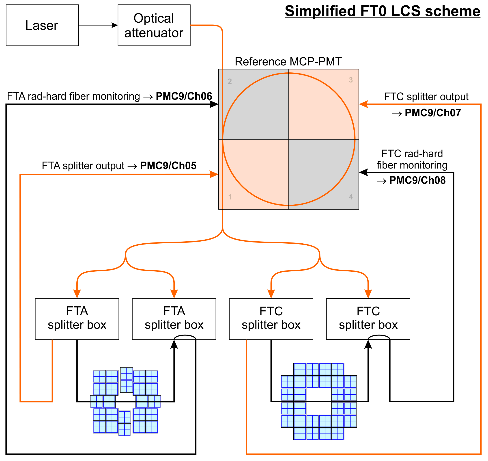

# FT0 quality control

- [RecPoint QC](#recpoint-qc)
  - [Output](#output)
- [Aging monitoring](#aging-monitoring)
  - [Monitoring principles](#monitoring-principles)
  - [AgingLaserTask configuration](#aginglasertask-configuration)

## RecPoint QC

### Output

#### Amplitude

| Name                   | Type   | Description                           |
|------------------------|--------|---------------------------------------|
| `AmpPerChannel`        | `TH2F` | Amplitude per channel                 |
| `Amp_vs_time_channelX` | `TH2F` | Amplitude vs time, channel X;Amp;Time |

#### Time

| Name                | Type   | Description                                |
|---------------------|--------|--------------------------------------------|
| `TimePerChannel`    | `TH2F` | Time per channel                           |
| `CollTimeAC`        | `TH1F` | (T0A+T0C)/2;ps                             |
| `CollTimeA`         | `TH1F` | T0A;ps                                     |
| `CollTimeC`         | `TH1F` | T0C;ps                                     |
| `SumTimeAC_perTrg`  | `TH2F` | (T0A+T0C)/2 per Trigger;Time [ps]; Trigger |
| `DiffTimeAC_perTrg` | `TH2F` | (T0C-T0C)/2 per Trigger;Time [ps]; Trigger |
| `TimeA_perTrg`      | `TH2F` | T0A per Trigger;Time [ps]; Trigger         |
| `TimeC_perTrg`      | `TH2F` | T0C per Trigger;Time [ps]; Trigger         |
| `ResCollTimeA`      | `TH1F` | (T0Aup-T0Adown)/2;ps                       |
| `ResCollTimeC`      | `TH1F` | (T0Cup-T0Cdown)/2;ps                       |

#### BC

| Name             | Type   | Description                |
|------------------|--------|----------------------------|
| `BC_perTriggers` | `TH2F` | BC per Triggers;BC;Trigger |

## Aging monitoring

The aging monitoring of FT0 is performed by 1 minute long laser runs that should be launched after each beam dump. A dedicated QC task is analyzing the laser data: `o2::quality_control_modules::ft0::AgingLaserTask`.

At the moment the QC task is adapted to the FT0 laser calibration system (LCS) and the monitoring of the FT0 aging. If needed, the task can be generalized to work with other FIT detectors.

### Monitoring principles

The schematics of the LCS is shown below. Per laser pulse, there will be two signals in each reference channel and one signal in each detector channel. The signals are separated in time by well defined delays, so one can identify them by BC ID.

More information about the LCS and the hardware side of the aging monitoring can be found [here](https://indico.cern.ch/event/1229241/contributions/5172798/attachments/2561719/4420583/Ageing-related%20tasks.pdf).

### `AgingLaserTask` configuration

An example configuration can be found in `etc/ft0-aging-laser.json`. The task parameters are:

- `detectorChannelIDs`: list of detector channels to be monitored. Omit this parameter to use all.
- `referenceChannelIDs`: the reference channel IDs, should be: "208, 209, 210, 211".
- `detectorAmpCut`: Lower cut on the detector amplitude in ADC ch, default "0". **TODO**: this has no effect at the moment.
- `referenceAmpCut`: Lower cut on the reference channel amplitude in ADC ch to ignore cross talk, default "100".
- `laserTriggerBCs`: list of BCs when the laser fires, should be "0, 1783".
- `detectorBCdelay`: amount of BCs after the laser trigger BCs when the laser pulse is expected in the detector, should be "131".
- `referencePeak1BCdelays`: amount of BCs after the laser trigger BCs when the first laser pulse is expected in the reference channels, should be "115, 115, 115, 115". One value per reference channel, even though they will be the same with the current LCS setup.
- `referencePeak2BCdelays`: amount of BCs after the laser trigger BCs when the second laser pulse is expected in the reference channels, should be "136, 142, 135, 141". One value per reference channel.
- `debug`: If true, an additional set of plots can be produced for debugging purposes, default "false".

The channel ID and BC values delays are rather fixed and should not change unless the LCS changes significantly.

**TODO**: should we apply the amplitude cuts in the SliceTrendingTask instead?
