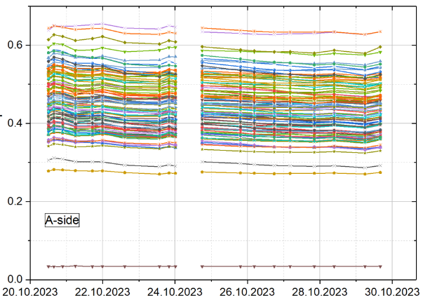
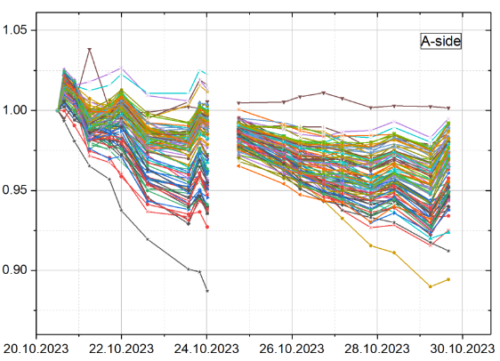

# FT0 quality control

## Aging monitoring

_The following documentation conserns FT0 aging **monitoring**. Software to deduce the aging **correction** will come later._

The aging monitoring of FT0 is performed by 1 minute long laser runs that are launched after each beam dump.

Dedicated QC tasks analyze the data:

- `o2::quality_control_modules::ft0::AgingLaserTask` - raw collection of the data
- `o2::quality_control_modules::ft0::AgingLaserPostProc` - post processing of the data
- `o2::quality_control::postprocessing::SliceTrendingTask` (?) - trending of the post processed data

At the moment the QC tasks are adapted to the FT0 laser calibration system (LCS) and the monitoring of the FT0 aging. If needed, the tasks can be generalized to work with other FIT detectors.

### Monitoring principles

The schematics of the LCS is shown below. Per laser pulse, there will be two signals in each reference channel and one signal in each detector channel. The two signals in the reference channels are separated in time by well defined delays, so one can identify them by BC ID.

The basic idea is to monitor the amplitudes seen in the detector during the laser runs. The reference channels don't age and the amplitude in these is used as a normalization factor to the detector channel amplitudes.

More information about the LCS and the hardware side of the aging monitoring can be found [here](https://indico.cern.ch/event/1229241/contributions/5172798/attachments/2561719/4420583/Ageing-related%20tasks.pdf).

### Aging monitoring QC tasks

#### AgingLaserTask

The `AgingLaserTask` task collects the raw data from the laser runs.

##### Output

| Name                     | Type | Description                                                      |
|--------------------------|------|------------------------------------------------------------------|
| `AmpPerChannel`          | TH2I | Amplitude distribution per channel (both ADCs)                   |
| `AmpPerChannelADC0`      | TH2I | Amplitude distribution per channel for ADC0                      |
| `AmpPerChannelADC1`      | TH2I | Amplitude distribution per channel for ADC1                      |
| `AmpPerChannelPeak1ADC0` | TH2I | Amplitude distribution per channel for the first peak with ADC0  |
| `AmpPerChannelPeak1ADC1` | TH2I | Amplitude distribution per channel for the first peak with ADC1  |
| `AmpPerChannelPeak2ADC0` | TH2I | Amplitude distribution per channel for the second peak with ADC0 |
| `AmpPerChannelPeak2ADC1` | TH2I | Amplitude distribution per channel for the second peak with ADC1 |
| `TimePerChannel`         | TH2I | Time distribution per channel (both ADCs)                        |
| `TimePerChannelPeak1`    | TH2I | Time distribution per channel for the first peak (both ADCs)     |
| `TimePerChannelPeak2`    | TH2I | Time distribution per channel for the second peak (both ADCs)    |

A set of debug histograms can be set if the `debug` parameter is set to `true`. See the task header file for the definition of these histograms.

##### Configuration

An example configuration can be found in [ft0-aging-laser-task.json](https://github.com/AliceO2Group/QualityControl/blob/master/Modules/FIT/FT0/etc/ft0-aging-laser-task.json). The task parameters are listed in the table below.

| Task parameter           | Default   | Description                                                                                                                                                                                                        | Value to be used       |
|--------------------------|-----------|--------------------------------------------------------------------------------------------------------------------------------------------------------------------------------------------------------------------|------------------------|
| `detectorChannelIDs`     | `""`      | List of detector channels IDs to be monitored. Omit this parameter to use all.                                                                                                                                     | `""`                   |
| `referenceChannelIDs`    | ?         | List of reference channels IDs to be used. For legacy reasons, the second reference channel (channel ID = 209) is not used.                                                                                        | `"208, 210, 211"` |
| `laserTriggerBCs`        | ?         | List of BCs when the laser fires.                                                                                                                                                                                  | `"0, 1783"`            |
| `detectorBCdelay`        | ?         | Amount of BCs after the laser trigger BCs when the laser pulse is expected in the detector channels.                                                                                                               | `"131"`                |
| `referencePeak1BCdelays` | ?         | Amount of BCs after the laser trigger BCs when the first laser pulse is expected in the reference channels. There's one value per reference channel, even though they will be the same with the current LCS setup. | `"115, 115, 115, 115"` |
| `referencePeak2BCdelays` | ?         | Amount of BCs after the laser trigger BCs when the second laser pulse is expected in the reference channels.                                                                                                       | `"136, 142, 135, 141"` |
| `gainInADCsPerMIP`       | `""`   | The gain in ADCs per MIP.                                                                                                                                                                                          | `"14?"`                |
| `debug`                  | `"false"` | If true, an additional set of plots can be produced for debugging purposes.                                                                                                                                        | `"false"`              |

The channel ID and BC values delays are rather fixed and should not change unless the LCS changes significantly.

##### TODO

- The MO's should be distinguished by:
    - Gain setting (number of ADC channels per MIP)
        - In the future we will fetch this from CCDB, but at the moment we pass the value via the QC config.
    - The gain will be stored in the MO metadata. This can then be used as we wish in the post processing.
    - B field -> We decided not to care about this (???)
        - Can be fetched from GRP in CCDB (?)
- Should we have some out-of-bunch checking as part of a LCS sanity check?
- The ECS run needs to be slightly longer than the QC task cycle, so that all postprocessing has time to run.

#### `AgingLaserPostProc`

The `AgingLaserPostProc` task reads the data collected by the `AgingLaserTask` and produces output suitable for aging monitoring.

##### Output

| Name                                           | Type | Description                                                                                                                                                                                                                                                                                                                                               |
|------------------------------------------------|------|-----------------------------------------------------------------------------------------------------------------------------------------------------------------------------------------------------------------------------------------------------------------------------------------------------------------------------------------------------------|
| `AmpPerChannelStatMean`                        | TH1F | Statistical mean of the amplitudes per channel                                                                                                                                                                                                                                                                                                            |
| `AmpPerChannelNormStatMean`                    | TH1F | Statistical mean of the amplitudes per channel normalized with the average of the statistical means of the reference channel amplitudes                                                                                                                                                                                                                                   |
| `AmpPerChannelNormStatMeanAfterLastCorrection` | TH1F | Statistical mean of the amplitudes per channel normalized with the average of the statistical means of the reference channel amplitudes. **This histogram is published ONLY during a _resetting_ run**. This means that this MO contains the amp per channel info from the last aging correction, and can hence be used as a scaling factor to determine relative aging since the last correction.  |
| `AmpPerChannelNormStatMeanCorrected`           | TH1F | Statistical mean of the amplitudes per channel (normalized with the average of the statistical means of the reference channel amplitudes) normalized with the same histogram from last aging correction. I.e. this is `AmpPerChannelNormStatMean` / `AmpPerChannelNormStatMeanAfterLastCorrection` and shows the aging relative to the time of the last aging correction. |

##### Configuration

An example configuration can be found in `etc/ft0-aging-laser-postproc.json`. The task parameters are listed in the table below.

| Task parameter | Default   | Description                                                                                                                                                                                                                                                                                                | Value to be used |
|----------------|-----------|------------------------------------------------------------------------------------------------------------------------------------------------------------------------------------------------------------------------------------------------------------------------------------------------------------|------------------|
| `reset`        | `"false"` | Once an aging correction has been performed, this should be set to `true` for the next run to indicate that the `AmpPerChannelNormStatMean` histogram should also be saved as `AmpPerChannelNormStatMeanAfterLastCorrection`. Once run like this, it has to be set back to `false` for the following runs. |                  |

##### **TODO**

- Parametrize and apply ampltiude cuts for all amplitudes used for anything in the post processing task.

#### Trending

The main indicator of detector aging is the per channel values in `AmpPerChannelNormStatMeanCorrected`. Right after an aging correction, these values will be 1. After some time, these values will reflect the aging relative to the last aging correction. Trending these values clearly visualizes the aging. A fraction check could also be applied on this histogram, and its result could be checked by the central QC shifter.

Pic from Yury equivalent to a trend of `AmpPerChannelNormStatMean`:

Pic from Yury equivalent to a trend of `AmpPerChannelNormStatMeanCorrected`:

### Operation

The procedure for operating the aging monitoring QC is as follows:

- When the QC indicates aging that warrants a HV correction, the correction is done by a FIT expert (Yury).
- Immediately after aging correction, the QC trends needs to be reset:
    - the aging monitoring QC configs needs to be changed as follows:
        - `reset` parameter in `AgingLaserPostProc` needs to be set to `true`.
        - `resumeTrend` parameter in the trending tasks needs to be set to `false`.
    - A laser scan should be launched by a FIT expert. The ECS config `FT0_LASER_AGING` should be used. This resets the trends and saves the `AmpPerChannelNormStatMean` histogram as `AmpPerChannelNormStatMeanAfterLastCorrection`, which will be used as the normalization factor for future runs.
    - The previously applied QC config changes needs to be reverted.
- Now the aging monitoring will proceed as usual, without manual intervention until it's time for the next aging correction.